# My 90s Notebook

Welcome to My 90s Notebook. This is a web app I've made using MERN stack to create a social media site with 90s flair. I did this for a few reasons. First one being, I'm a child of the 90s and have a lot of nostalgia for that certain 90s aesthetics (but NOT 90s web design, that was a mess!) Second, I wanted to implement ideas to create a social media experience that might solve some of the problems that social media as it exists today has created.

You can visit the live site now and even try it out for yourself [here!](https://www.my90snotebook.com). Keep in mind that while this is a live site, I'll still be adding new features to it. It's also important to note that the back end uses a "sandbox" level database an no data except for the password you create is going to be encrypted, so maybe don't go writing down your PIN or any family secrets on there for the time being.

As I migrate the db to a new host, there exists the possibility that all the data may need to be wiped, so don't put anything you need to keep in there either. It's really just a toy to play around with in this state, is what I'm saying.

## Tools Used

As mentioned above, this project is built on the MERN stack (MongoDB, Express, React, and Node) and uses NPM for it's dependencies. The back-end uses Mongoose to create db schemas and bcrypt, passport, and passport-jwt to handle authentication.

The front-end was built using "create-react-app". I also used Redux to help with state management, axios to query the database, and node-sass to compile the sass files into a compressed css file.

## How it Works

When a user first visits the site, they will be greeted with a splash page that has the logo and options to login or register at the top of the page.

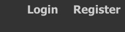

To sign up, all a user needs to do is enter an email address, set a password and confirm that password and click the "Sign Up" button. It's that easy!

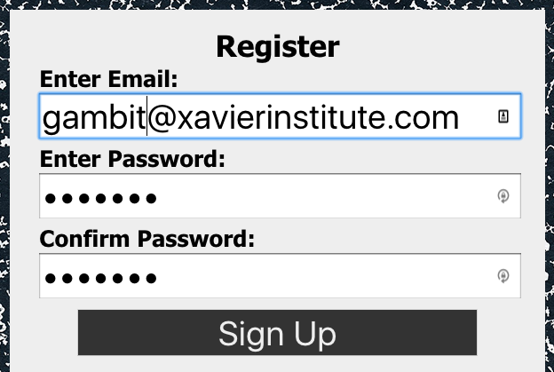

Once a user is registered, they'll be redirected to the login page. They can enter the credentials they just created and log in.

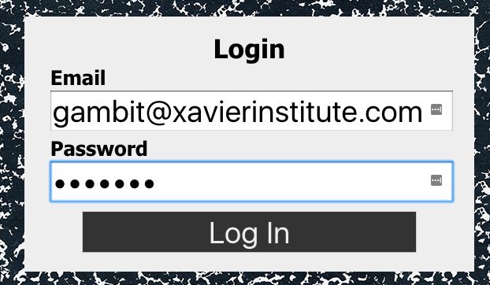

When a user logs in for the first time, they won't have a profile by default. Users without profiles will be redirected to the settings page automatically so they can enter their information. They will have a place to enter their name, last name, preferred nickname, and a short bio.

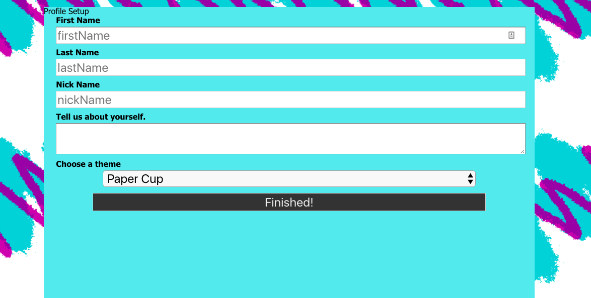

There's also a dropdown menu that will allow the user to pick from one of the available themes. The theme "paper cup" is active by default but there are a variety of 90s inspired themes to pick from and I plan to continue adding more.

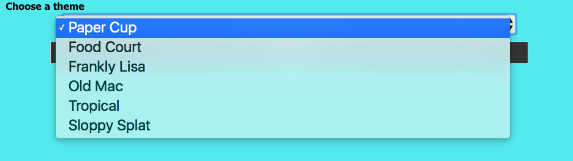

Updating the theme options will immediately change the look of the site.

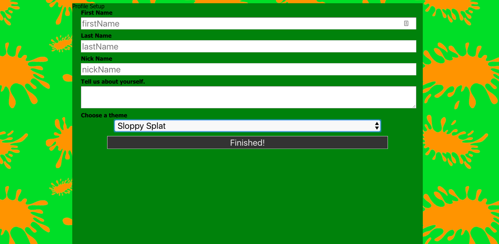

When users are logged in, the "Login" and "Register" options are replaced with "Menu", "Settings", and "Logout" buttons. Note that the icons on the buttons change with the theme of the site.

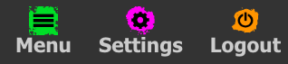

A user that has a profile will be sent to the dashboard by default when they log in. This dashboard will display notifications that get generated when certain things happen (when someone accepts your friend request for example.) The dashboard is the main page for the user and is where they will go if the click on the "90s Notebook" icon in the upper left corner of the nav bar.

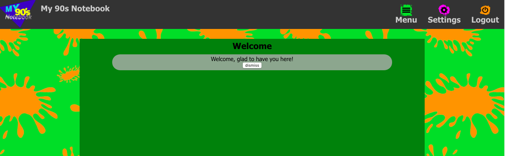

Clicking on the "Settings" icon in the nav will send the user back to the "Settings" page where they can update their information.
Clicking on the "Menu" icon will display the submenu which gives the user access to all the other features of the site. Users can toggle this menu's visibility by clicking the "Menu" icon.

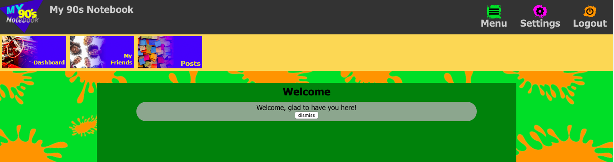

The "Friends" area lets you search for people you may know by their email address or by their names. Any matches to your search criteria will appear in a list on the right. Each person on that list will have a button under there name if you're not already friends with the person. Clicking on the "Send Friend Request" button will send a friend request to that user who can then accept or deny the request. (Note that for privacy reasons, we don't alert users if the event their request was denied. It will just show as "pending" indefinitely until the sender deletes the request themselves.)

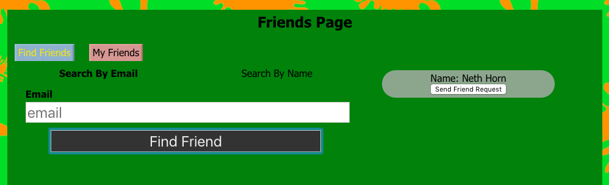

Users can view a list of their own friends, as well as a list of pending requests they have received and pending requests that they sent by clicking on the "My Friends" button.

The "Posts" area is where users can create posts that can be viewed by their friends. To compose a post, just enter some text in the text field and click "Create Post". Posts are listed in chronological order with the most recent post displayed first.

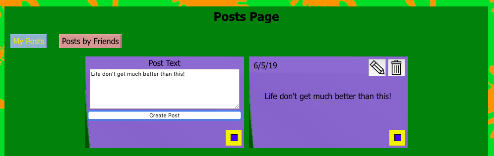

Users can update their posts at any time by clicking on the post's pencil icon, and can delete the post by clicking the trash can icon. You'll be warned before deleting a post that it can't be undone to prevent accidental deletes.

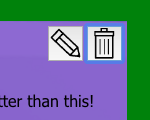

Users can also adjust a post color by clicking on the colored square in the bottom right corner of the post and selecting a color. The sample post containing the text area for creating new posts also has one of these allowing the user to select their own default color.

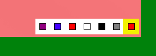

Clicking on the "Posts by Friends" button will display a list of all posts by all of the friends the user has in chronological order. There is a limit of six posts per user. If a user has created six posts, they be prompted to delete one of the old ones before they can create a new one. This limitation is in place to prevent a user's friend posts board from becoming too long and to keep people from over-sharing.

## To Do

1. Menu Clean Up - Right now the menu buttons aren't as nice as I'd like them to look.
1. To Do Lists - To do lists are fun and simple things to create. An older version of this site had a to-do list feature and I'd like to add that back in.
1. Messages - The friending feature is working, but outside of posts they don't have ways to interact. I want to fix that.
1. A Game? - I've had an idea rolling around in my head for awhile of incorporating a game into this. What kind of game? Well, I'm keeping that close to the vest for now. But it will certainly be very 90s.

Note: This is NOT a request for collaboration on this. While I really appreciate the offer, this is a labor of love for me that I want to work on myself. You're welcome to fork this and add other features for yourself, of course.

## Credits

This was, as mentioned above, built in the MERN stack. Here are links to sites with documentation for all of the component parts of MERN...

- [MongoDB](https://www.mongodb.com/)
- [ExpressJS](https://expressjs.com/)
- [React](https://reactjs.org/)
- [NodeJS](https://nodejs.org/en/)

The database is hosted on [mLab](https://mlab.com/) but that will need to change in the near future as I believe they are migrating to MongoDB Atlas.
